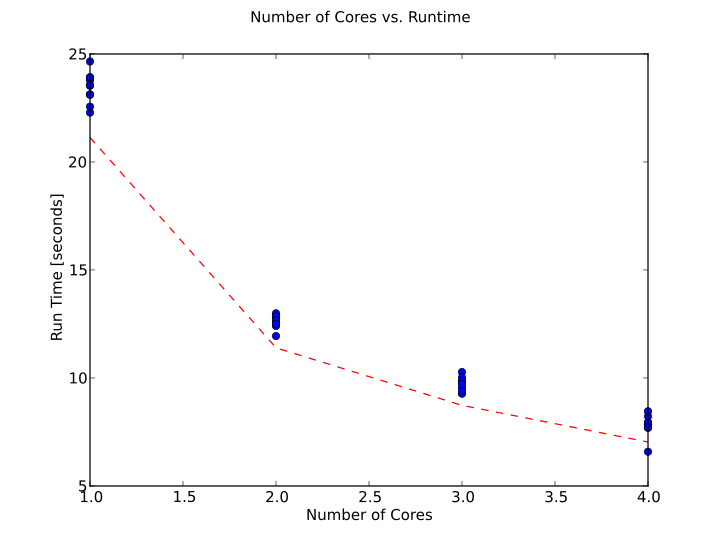

% An Web Based Asynchronous Implementation of SRIM
% Chris Ostrouchov
% 12/01/2013

# 1 Nature of Project
My project can be broken into two separate parts. The reason for two parts to the project is because of my ambitious goal of creating a truly platform independent parallel code via the web.  

The first part is a parallel rewrite of a code [SRIM](http://www.srim.org) that is used to simulate the penetration of ions in matter. SRIM was developed in the early 1970 written originally in FORTRAN. SRIM works using a Monte Carlo approach to modeling the ion paths. Modeling the ion paths can become a very complex problem due to the high energies, cascades that results from the [Nuclear Stopping](http://en.wikipedia.org/wiki/Stopping_power_(particle_radiation)), and accurately modeling the atom potentials at close contact. Python was chosen to write the program due to its easy testing and fast development time. As SRIM is a Monte Carlo code it lends it self very nicely to becoming parallel.

The second part of the project is a web interface that allows a user to submit jobs to be run on a cluster, view a database of the jobs, and view detailed reports of the statistics and plots created from a job. It will be mentioned several times but the web interface for my SRIM code can be found at [SRIM Web Interface](http://finch.desktops.utk.edu). I have always been frustrated that I have been unable to "show off" my work to other people. In order to run a code (SRIM) in the background one must consider many key parallel elements that must run together. A database of jobs and job results, a job queue for running jobs asynchronously and in parallel. I have yet to see an example elsewhere of a group giving a server based implementation of their scientific software. A huge advantage of this approach allows the application (pySRIM) to be updated in the background without the user knowing.

# 2/3 Importance of Project and Related Work

SRIM is a code that is used by many nuclear and material engineers daily. In fact our group uses the code daily. A simple web search shows that SRIM is used quite heavily ([Google Search: srim ion](https://www.google.com/search?q=srim#q=srim+ion)) The 1977 version of the code was made available to our group 2 years ago. It is severely limited however since the code has been updated since then (2008). There are many motivators as to why a SRIM successor is necessary:

- Windows only
- requires a GUI (no command line controls)
- __serial__
- black box (we would like to modify parameters)
- non-open source (somewhat ties to previous statement)

Therefore I have embarked on a rewrite of the SRIM code (pySRIM). For this project I have written the full __Algorithm__ with incorrect mathematics. I have not done the full correct calculations due to the complex math involved that I plan to work out next semester. When this code is complete it will enable my group to run faster srim calculations with more interaction between computations and experiments with our Ion Beam at UT. While it was only briefly mentioned that the code is serial, SRIM being serial is one of the major factors involved that require a newer code (run times can sometimes exceed 1-10 days and crash due to memory limitations). The new SRIM code for now is being written in python with the extensions: numpy, matplotlib, pandas, and mpi4py.

The web is becoming more and more a platform for applications. However, one field that has not seemed to have approached this area is scientific research. Often times lab groups discus their implementations on a blog and some of the results they have found. However, rarely do the groups provide easy means to distribute and run the software. The compute power necessary to run these jobs is often times more than a small compute node of 1-4 cores can handle. As discussed before I wanted a means to show off my computationally intensive tasks to other users and allow them to easy run the software. In order to solve this problem of running my code and providing a web interface, I have had to use several programming languages and packages which will be discussed in the steps taken.

# 4 Steps Taken to Implement
## pySRIM

Refering to [github](http://github.com/costrou/pysrim) you can see the coding steps that were taken to develop the code. However, the git history does not tell the whole story. Since SRIM is a very complex code I spent about a week looking through the old fortran code (with tons of `GOTO` statements... luckily I had etags with emacs) and refering to a [book](http://www.srim.org/SRIM%20Book.htm) written on the code. Once I understood the Algorithms and had it written on paper I wrote the outline in python in serial (about 3-4 days). Getting my code to be parallel was surprisingly easy! Below I have detailed the few changes. Since the simulation is Monte Carlo, I split the number of ions to be shot between all of the processors.

```python
# Initialize MPI Enviroment
comm = MPI.COMM_WORLD
size = comm.Get_size()
rank = comm.Get_rank()

# We split the job among all the nodes running the job
myNumIons = numIons / size
if ((numIons % size) > rank):
    myNumIons += 1

ionStatistics = runSimulation(ion, target, numIons = myNumIons)
```

Once the simulation work of each core had been run, I then needed to __gather__ all the statistical data to one core. Gathering all the data was done at the end of the code due to the large amount of information being sent (10mb - 1gb) per core. This was done using a call ionStatistics.consolidate(comm) detailed below.

```python
def consolidate(self, comm):
    comm.Barrier()
	self.ids = comm.gather(self.ids, root=0)
	self.positions = comm.gather(self.positions, root=0)
	self.velocities = comm.gather(self.velocities, root=0)
```

Makefiles were written for ease of testing and deployment. 

# 5 Tests
The scientific parameters that the user can currrently change are the number of ions, energy of each ion, and element that the ion consists of. While the ion element does not have a significant effect of the run time, the number of ions and energy of each ion do. Since the cascades from the ions are random the run time of the program with the same parameters will often times be different.

Due to using mpi the number of cores used can be changed as well.

Thus I have identified three dimensions to the runtime of the code: number of cores, number of ions, energy of each ion.

The makefile provided with pysrim can test these via the command `make test`. It will automatically run each test and plot the resulting graphs seen below in section 8. The tests are expected to take roughly 30 minutes.

The [web interface](http://finch.desktops.utk.edu) has build in testing that provides the runtime for each job and postprocessing (creating plots, summary statistics, etc.).

# 6 Running Code
Sadly this code has multiple dependencies (mpi4py, pandas, matplotlib, and numpy) that I am not confident enough that I can provide configuration scripts to aleviate the problem of deploying it easily on your machine.

Thus I have provied a login on my machine that will allow you to test the code (all the configuration is done). I will keep this login available until grades are given out.  
__Username:__ cpsc462  
__Password:__ cpsc462  

## Running pySRIM
Read the github README! Run the executable as `python pysrim.py -h` for help.

## Running pySRIM via Web Interface
__But First__ please visit the web interface it allows you to run the code via a web browser and creates automatic plots and summary statistics. I have already included example jobs that were run via my machine as a web server.  
Submitting a job can be done [here](http://finch.desktops.utk.edu/submit)  
Viewing the database of jobs that have been run, are running, and are in the queue [here](http://finch.desktops.utk.edu/database)  
Viewing individual jobs that were run E.G [here](http://finch.desktops.utk.edu/job/1)  

# 7 Results of Tests

In the first plot we are comparing the number of cores used versus the runtime for the program. As expected the plot follows Amdals law $1/n$ described in the next section. 



The following next two plots demostrate that there is a linear relationship between the time the program takes and the ion energy and number of ions shot.


# 8 Agreemenet with Amdals Law
Amdals law can be used to predict the theoretical maximum speedup that a code will recieve when more cores are used.
$$T(n) = T(1)\left(B + \frac{1}{n}(1-B)\right)$$

Where $n \in \mathbb{N}$ is the number of cores and $B$ is the fraction of the code that is serial. T(n) is the expected time that it takes a program to complete on n cores.

As seen in the Figure 1 the program pySRIM follows Amdals law.

# 9 Link to Code
Both codes are available on Github and I plan to contribute to them often. Easily download them via `git clone`.  
pySRIM: [http://github.com/costrou/pysrim](http://github.com/costrou/pysrim)  
webinteractive: [https://github.com/costrou/WebInteraction](https://github.com/costrou/WebInteraction)  

Website: [http://finch.desktops.utk.edu](http://finch.desktops.utk.edu)
